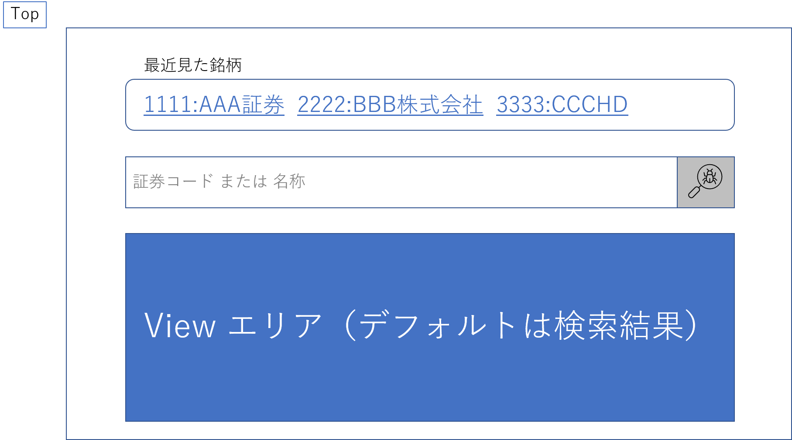
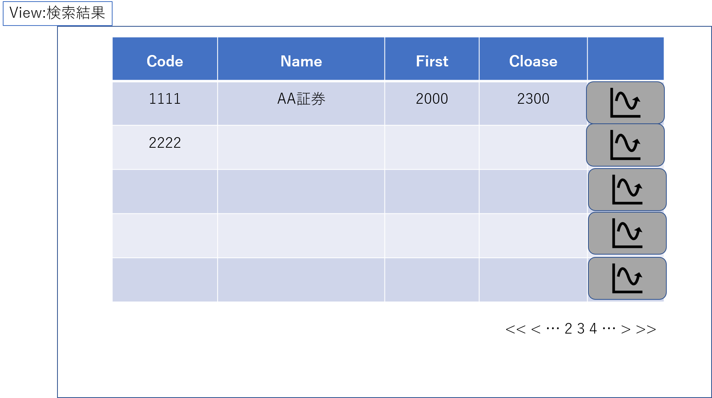
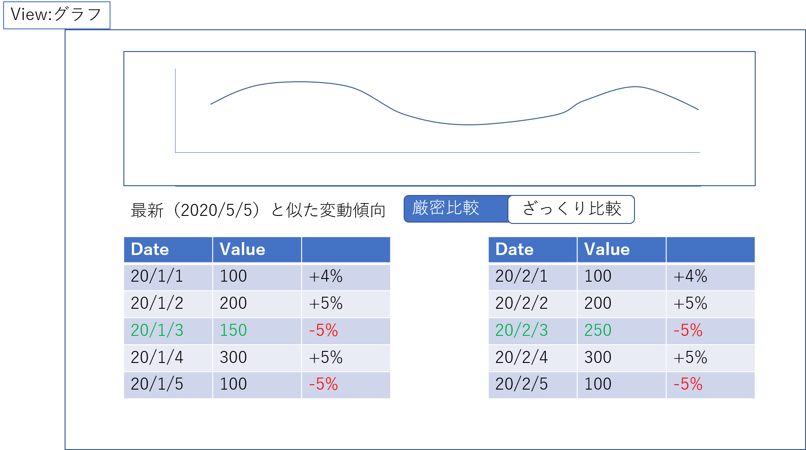

## 株価解析プロジェクト 計画編

### 前提
老後 2000 万円問題[1]が出てから株を始めたんですが、コロナの真っ只中でいろいろと胃が痛いこの頃です。

それはともかく、株って予測は難しいのですよね。機械学習で予測する[2]のもありますが、確率された手法もないようで、一喜一憂するしか現状方法がないですね。

なぜ難しいかと専門外の頭で考えた所、「外的要因が多すぎるのでは？」という考えになりました。現代は電子取引なのでポジ／ネガのニュースが流れると、それに連動して即反映されます。

歴史は繰り返すというので過去に似た動きがあれば似た要因で似た動きをするのではという仮定を立ててみました。

Python で作れば学習になって一石二鳥。目指せ不労所得です

### 仕様
- 機能
  - 株コードまたは名前で株を検索できる
  - 最新の株の動きを過去データと比較して似た動きをした期間を抽出できる
    - 増減率（少数切り捨て）、増減の2パターンで表示できる
  - 最新の株価をグラフ表示できる
  - 過去に見た株を最新5件記録できる
- 画面
  - 
    - 
  - 
- ソフトウェア類
  - Python
  - mariadb

### 参考
- [1] 「老後2000万円」は余裕の原資　年金の誤解を解く https://style.nikkei.com/article/DGXMZO46637970X20C19A6000000/
- [2] 【前編】ディープラーニングで株価予想！【Python】 https://rightcode.co.jp/blog/information-technology/python-deep-learning-stock-price-forecast-create#i-2